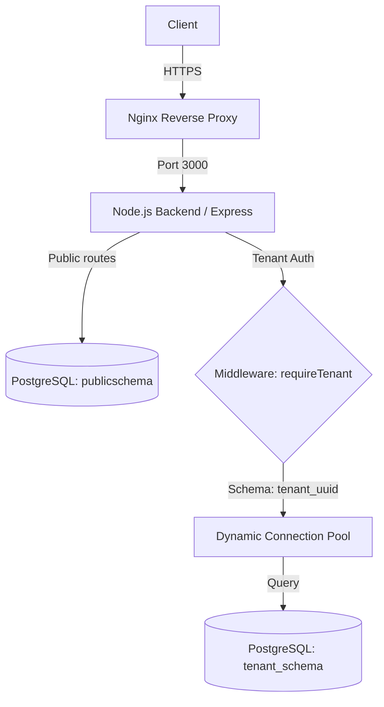

# Split Ledger Developer Guide

Welcome to the Split Ledger backend developer guide. This document explains the core architectural concepts, how tenant isolation works, and how to extend the platform.

## Architecture Overview

Split Ledger uses a **Shared Application, Isolated Database Schema** multi-tenant architecture. 
All tenants run on the same Node.js instances and connect to the same PostgreSQL database cluster, but their data is strictly isolated into separate PostgreSQL schemas (`tenant_1234567890abcdef`).



The general request lifecycle:
1. Client sends a request with `X-Tenant-ID` header (or subdomain parameter for dashboard).
2. The `tenantContextMiddleware` extracts the tenant identifier and validates it against the `public.tenants` table.
3. If valid, the middleware attaches `req.tenantId` and `req.tenantSchema` to the request object.
4. Business logic interacts with the database via the `tenantDb.query` wrapper, which dynamically manages connections to the correct schema, ensuring query isolation.

## Tenant Isolation (Schema-per-Tenant)

Data isolation is enforced at the database layer using PostgreSQL's `search_path`. 

### The `tenantDb.query` Wrapper
**Never use raw `pg.pool.query` for tenant data.** Always use the `tenantDb` export from `src/db/tenantDb.ts`.

```typescript
import { tenantDb } from '../db/tenantDb.js';

// GOOD: Connects to specific tenant schema
const { rows } = await tenantDb.query(
  req.tenantSchema,
  'SELECT * FROM users WHERE email = $1',
  [email]
);
```

Under the hood, `tenantDb` maintains a cache of connection pools per tenant and automatically runs `SET search_path TO ...` before yielding connections.

## How to Add a New Tenant-Scoped Table

Since each tenant has their own schema, creating a new table requires adding it to the `tenant_template` schema so that all future tenants automatically get it.

1. **Create the Migration**:
   Write a SQL up migration in the `db/migrations` folder (or run it centrally).
   
2. **Apply to `tenant_template`**:
   The `tenant_template` schema must include your new table structure.
   ```sql
   CREATE TABLE tenant_template.new_feature (
       id UUID PRIMARY KEY DEFAULT gen_random_uuid(),
       name VARCHAR(255) NOT NULL,
       created_at TIMESTAMP WITH TIME ZONE DEFAULT NOW()
   );
   ```

3. **Clone to Existing Tenants**:
   If there are existing tenants in production, you must write a migration script that iterates over `SELECT schema_name FROM information_schema.schemata WHERE schema_name LIKE 'tenant_%'` and runs your `CREATE TABLE` statement inside each schema.

## Adding Route Middleware (Protection)

Most business logic routes reside under `/api` and require authentication and tenant context.

```typescript
import { requireTenant } from '../middleware/tenantContext.js';
import { requireAuth } from '../middleware/auth.js';
import { requireRole } from '../middleware/requireRole.js';

router.post(
  '/dashboard/settings',
  requireTenant,               // Ensures X-Tenant-ID is valid
  requireAuth,                 // Requires JWT access_token
  requireRole('admin', 'owner'), // Enforces RBAC
  async (req, res) => {
    // Both req.tenantId and req.userId are guaranteed here
  }
);
```

For programmatic API routes capable of accepting both User JWTs and API Keys, use `requireAuthOrApiKey`:
```typescript
import { requireAuthOrApiKey } from '../middleware/auth.js';

router.post('/webhooks', requireTenant, requireAuthOrApiKey, async (req, res) => {
  // Can be accessed via Dashboard or API Key automatically
});
```

## Running Tests Locally

We use Vitest for both unit and integration tests.

To run the test suite:
```bash
# Set up full testing database & migrate it
npm run migrate:up

# Run tests
npm test
```

### Addressing Test Race Conditions
**Important**: Tests share a global database locally. `vitest.config.ts` has `fileParallelism: false` explicitly so that `afterAll` test teardown scripts don't drop tables while another test file is running. Do not re-enable parallelism without rewriting the test setup hooks to use disparate databases.

## Mock Payment Provider for Development

By default in `development` and `test` environments, the backend initializes a mock payment provider instead of connecting to Stripe. 

If you want to test the Stripe implementation locally:
1. Copy your Stripe Secret key into `.env` (`STRIPE_SECRET_KEY=sk_test_...`)
2. Change `PAYMENT_PROVIDER=stripe` in `.env`
3. Restart the server.
